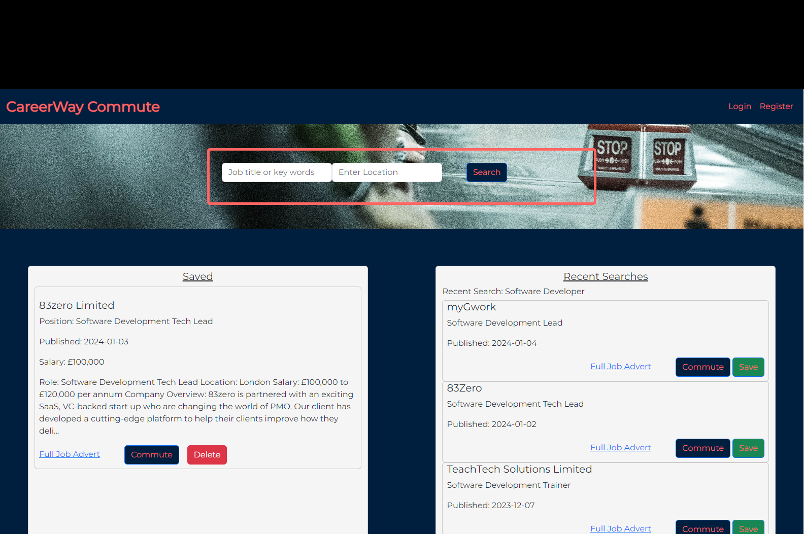
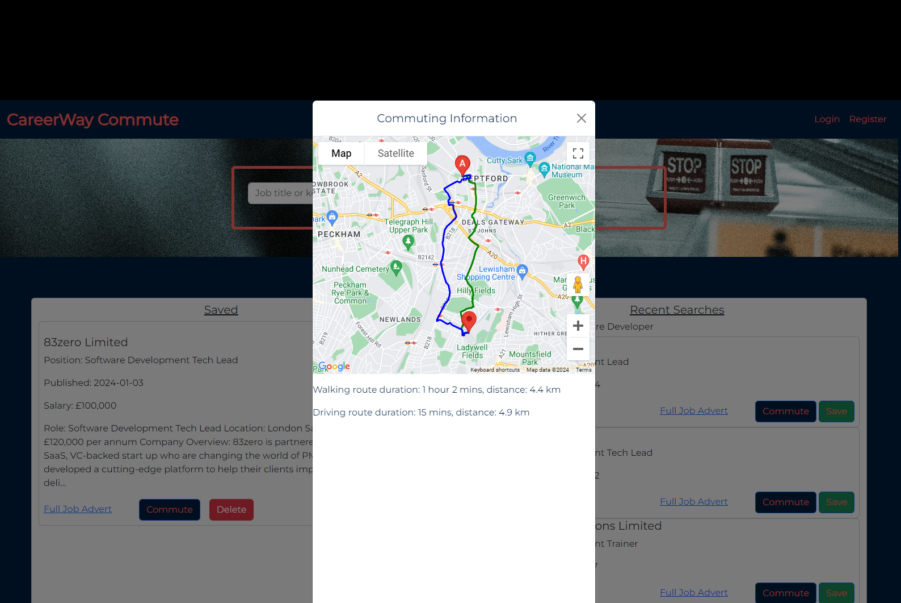

# careerway-commute

job search and commute website

## Description

## Installation

No installation needed

[Click here to see live copy of the site](https://lav3ll.github.io/careerway-commute/)

[Link to careerway commute](https://github.com/lav3ll/careerway-commute)

## Usage

**Key Features:**

- Advanced Job Search: Effortlessly find jobs by location, industry, or specific keywords.
- Saved Jobs: Save and organize preferred job listings for later reference.
- Recent Searches: Easily track and revisit recent job searches.
- Map Integration: Visualize job locations and plan commutes using integrated maps.
  
- User Account: Register and log in to access personalized job-saving features.
- Responsive Design: Enjoy seamless browsing on various devices for an optimized experience.

**Goals and Results:**

careerway commute aims allow users to search for jobs and simultaneously view commute times from their current location to potential workplaces.

## Credits

Skills For Life
Ed X

## License

MIT License
